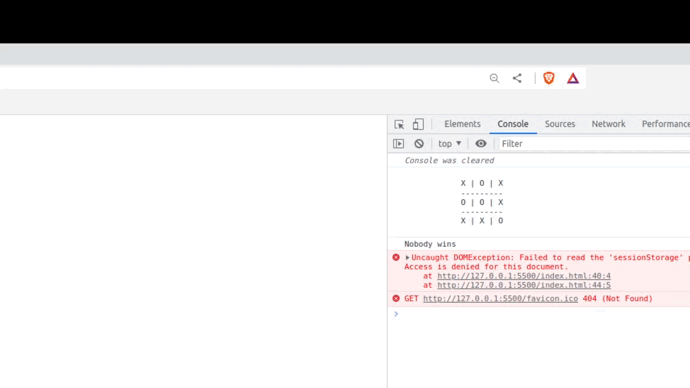
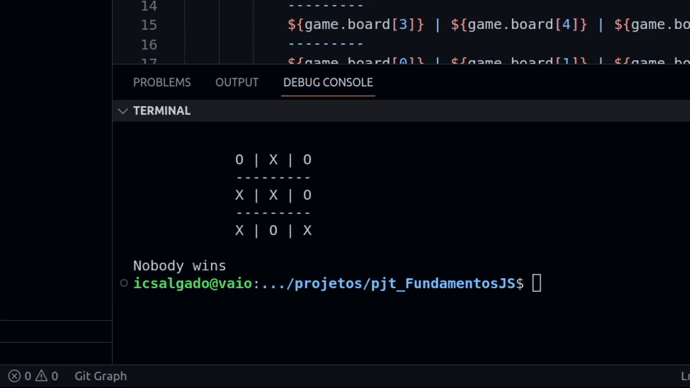

# Final Project - JavasScript Fundamentals

 - <a href="https://www.treinaweb.com.br/certificado/WUV9Z1YPZ9ZU" target="_blank">Certificate</a> -
<a href="https://www.treinaweb.com.br/curso/javascript-fundamentos/ementa/javascript-fundamentos.pdf" target="_blank">Syllabus</a>

## Goal

> The project was based in a model developed with the instructor of the course. The objective was apply the concepts of JavaScript, running on browser's console or in the terminal using NodeJS. It was implemented a Tic-Tac-Toe game.

### The Project in JavasScript

### The Project in NodeJS

